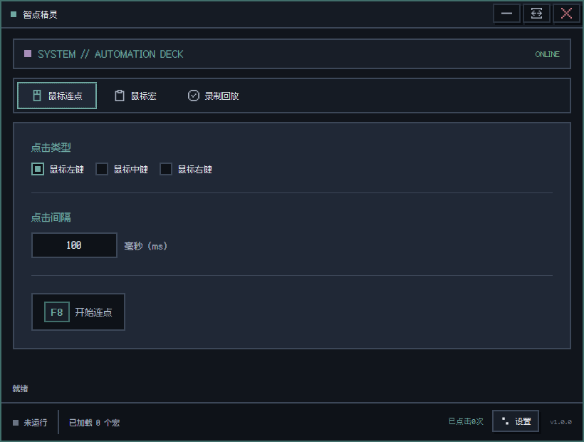
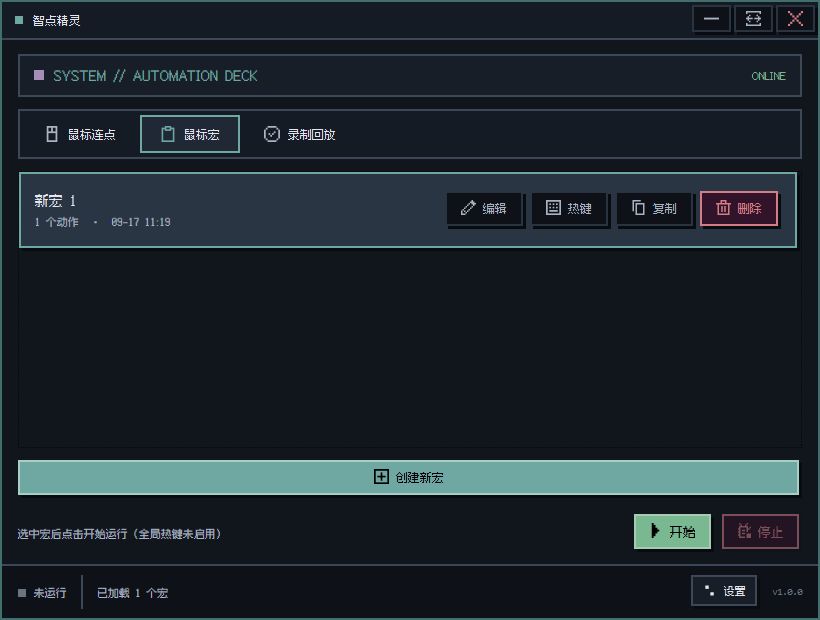
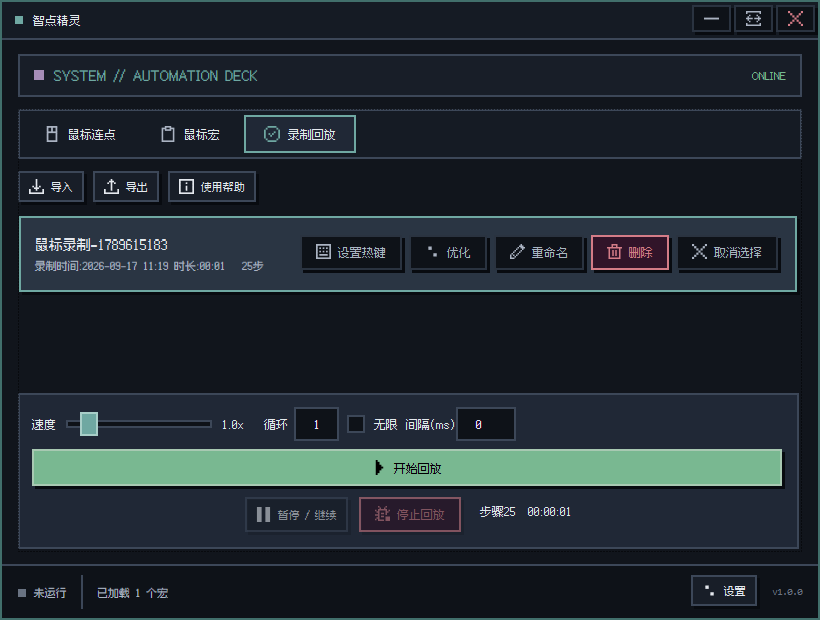
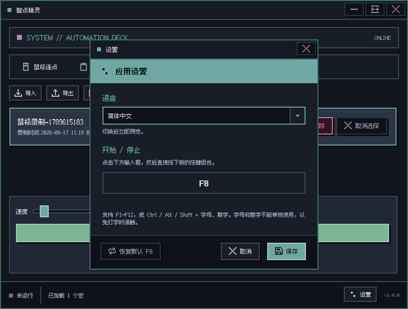
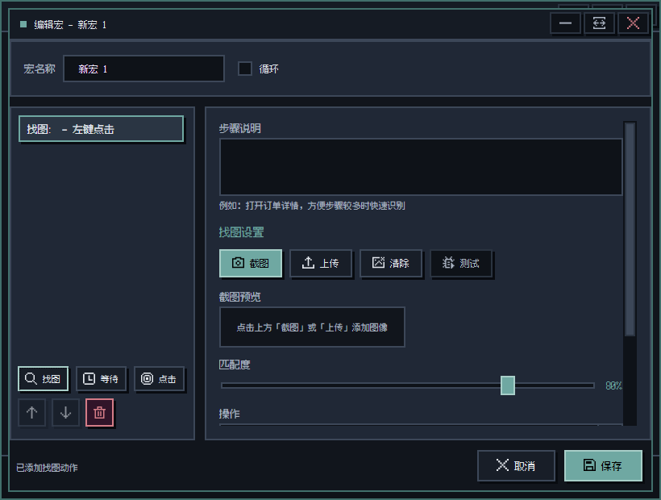

[简体中文](README.md) | [English](README.en.md)

# 🎯 智点精灵 Ming AutoClicker

**Windows 自动连点、鼠标键盘录制回放、鼠标宏与图像识别找图点击工具**

一款基于 WPF + OpenCV 的 Windows 桌面自动化工具，支持自动连点、鼠标键盘录制回放、可视化宏编辑、图像识别找图点击与独立全局热键，适用于重复操作自动化和 UI 测试等场景。

A Windows Auto Clicker, Mouse &amp; Keyboard Macro Recorder, and image-recognition automation tool built with WPF + OpenCV.

---

## ✨ 功能亮点 Features

### 🖱️ 鼠标连点 Auto Clicker
- 支持左键、中键、右键点击
- 可自定义点击间隔（10ms ~ 60000ms）
- 实时显示点击次数统计
- 可配置全局热键一键启停（默认 `F8`）

### ⏺️ 录制回放 Mouse &amp; Keyboard Recorder
- 录制鼠标移动、点击、滚轮和键盘输入
- 支持暂停、速度调节、有限/无限循环与循环间隔
- 支持录制重命名、优化、搜索及 JSON 导入/导出
- 每条录制可绑定独立全局热键
- 显示器布局变化时自动映射虚拟桌面坐标

### 📋 宏编辑器 Macro Editor
- 可视化宏配置管理（创建、编辑、复制、删除）
- 支持多动作编排，拖拽排序
- 循环执行（可配置循环次数和间隔）
- JSON 持久化存储，原子写入防止数据损坏

### 🔍 图像识别找图 Image Recognition
- 基于 **Emgu.CV (OpenCV)** 高性能模板匹配引擎
- 缓存模板、灰度图和缩放结果，模板文件变化后自动失效
- 默认仅搜索原尺寸和 ±5%，可按步骤启用 0.5x ~ 2.0x 自适应缩放
- 灰度单轮匹配，低纹理模板自动切换为差异匹配
- 可调节匹配度阈值（默认 80%）
- 严格使用设置的阈值，不会自动降低阈值误判成功
- 支持全屏 / 区域截图
- 「等待直到找到」模式（自动轮询直至目标出现）
- 支持多显示器虚拟桌面和负坐标
- 可视化展示最佳候选、分数、尺度、耗时和失败原因

### 📐 区域截图 Region Capture
- 全屏覆盖式截图工具
- 拖拽选取目标区域
- 8 个调整手柄精调选区
- 实时显示选区尺寸信息

### 👾 像素街机界面 Pixel Arcade UI
- 深色街机像素主题与全套 WPF 自定义控件
- 内置开源中文像素字体，统一普通窗口、弹窗和截图覆盖层
- 响应式布局，窗口可自由缩放
- 底部状态栏实时反馈运行状态
- 支持简体中文和 English，可跟随系统语言或在设置中即时切换

---

## 📸 界面介绍 Interface Overview

### 主界面

| 鼠标连点 | 宏任务 |
|:---:|:---:|
|  |  |
| 设置点击类型与间隔，通过全局热键随时开始或停止。 | 创建和管理自动化宏，并可为每个宏设置独立热键。 |

| 录制回放 | 应用设置 |
|:---:|:---:|
|  |  |
| 录制鼠标和键盘操作，支持优化、变速、循环及独立热键。 | 切换界面语言，并设置全局开始 / 停止热键。 |

### 宏任务编辑

按顺序组合找图、等待和点击动作；找图步骤支持截图或上传图片，并可调整匹配度及执行参数。

---

## 🧰 环境与安装 Requirements

- 正式支持 Windows 11；Windows 10 可尝试运行，但不属于正式测试矩阵
- 发布包为 .NET 10 自包含应用，无需另行安装 .NET Runtime
- 从 [GitHub Releases](https://github.com/vigosss/AutoMouseClicker/releases) 下载并完整解压 ZIP 后运行 `Ming-AutoClicker.exe`
- 某些环境中的全局快捷键或模拟输入可能需要管理员权限

---

## 📖 使用指南 Usage

### 鼠标连点模式

1. 启动程序，默认进入「🖱 鼠标连点」选项卡
2. 选择点击类型（左键 / 中键 / 右键）
3. 设置点击间隔（单位：毫秒）
4. 将鼠标移至目标位置
5. 按全局快捷键（默认 `F8`）开始连点，再次按下停止；点击主窗口右下角可修改

### 宏编辑模式

1. 切换到「📋 鼠标宏」选项卡
2. 点击「＋ 创建新宏」
3. 点击「✏️ 编辑」进入宏编辑器
4. 添加动作（🔍 找图 / ⏱ 等待）
5. 配置动作参数后点击「💾 保存」
6. 选中宏后点击「▶ 开始」或按已设置的全局快捷键运行

### 找图动作配置

| 参数 | 说明 |
|------|------|
| 截图 | 点击「截图」按钮，拖拽选取目标图像区域 |
| 匹配度 | 模板匹配阈值，默认 80%（越高越严格） |
| 操作 | 找到后执行的操作（左键点击 / 右键点击） |
| X/Y 偏移 | 点击位置相对于匹配中心的偏移量 |
| 等待直到找到 | 启用后会持续搜索直到目标出现或超时 |

### 快捷键

| 快捷键 | 功能 |
|--------|------|
| `F8`（默认，可修改） | 开始 / 停止（连点或宏执行） |
| `ESC` | 关闭截图窗口 / 匹配结果窗口 |

点击主窗口右下角的「⚙ 设置」可修改全局快捷键；支持 F1–F12，以及带 Ctrl、Alt 或 Shift 的字母和数字组合。

### 语言设置

应用首次启动时跟随 Windows 显示语言：中文系统显示简体中文，其他系统显示英文。点击主窗口右下角的「⚙ 设置」，可选择「跟随系统」「简体中文」或「English」，切换后立即生效。

## 📋 更新日志 Changelog

### v1.0.0
- 🎨 全面升级像素风深色界面，统一窗口、按钮、列表、表格与滚动条样式
- ⏺️ 优化录制回放工作流，精简录制列表并完善重命名、导入、导出与独立热键设置
- 🛠️ 增强录制优化器，支持直接编辑动作等待、坐标和按键，启用状态可单击切换
- 🖥️ 修复录制或回放期间页面变白、列表自动跳转及控件对齐和文字裁切问题
- ⌨️ 修复清除独立热键时窗口意外关闭，以及热键切换后的残留和误触发问题
- 📸 修复宏任务区域截图误退出和重复打开窗口的问题，并改善截图选择体验

### v0.6.0
- ⏺️ 新增鼠标键盘录制与回放，可记录移动、点击、滚轮和键盘输入
- ⏯️ 支持暂停、速度调节、有限/无限循环及循环间隔
- 📋 新增录制列表管理、搜索、重命名、优化及 JSON 导入/导出
- ⌨️ 宏和录制均可绑定独立全局热键，并支持任务间安全切换
- 🖥️ 保存虚拟桌面布局，显示器配置变化时可映射回放坐标
- 🛡️ 增强录制数据原子保存、损坏文件备份和回放停止时的输入释放
- 🌐 新增简体中文 / English 双语界面，支持跟随系统语言和即时切换
- ⚙️ 将语言与全局快捷键整合到统一设置窗口

### v0.5.0
- ⌨️ 支持自定义全局启停热键，默认保留 F8
- 🔢 支持 F1–F12，以及 Ctrl、Alt、Shift 搭配字母或数字
- 💾 快捷键配置按 Windows 用户持久化，应用更新后继续保留
- 🛡️ 新热键冲突或注册失败时保留原热键，启动失败时安全回退
- 🖱️ 主窗口、连点页和宏页同步显示当前实际生效的快捷键

### v0.4.0
- 🚀 重构找图流程：默认 3 个快速尺度，可按步骤启用宽范围自适应缩放
- 💾 缓存模板、灰度图和缩放结果，模板文件变化后自动失效
- 🎯 严格执行用户阈值，低纹理模板使用专门匹配方式
- 📊 异步测试匹配展示最佳候选、分数、尺度、耗时和失败原因
- 📝 宏步骤支持说明文字，找图支持导入本地图片
- 🖥️ 完善多显示器、负坐标和 DPI 下的截图、匹配及点击换算
- 🛡️ 修复宏列表跳选、停止后残留点击、步骤失败后继续执行和连点假停止
- 💿 增强宏原子保存、稳定排序、旧宏兼容和未使用截图清理
- 🔒 增加单实例运行限制与 F8 热键注册失败提示
- 🔗 优化桌面快捷方式：首次仅询问一次，尊重用户手动删除，并在程序路径变化后自动修复目标

### v0.3.2
- 🐛 修复第二次搜索反而更慢且找不到的问题（移除不稳定的 ORB 验证）

---

## 📄 许可证 License

本项目基于 [MIT License](LICENSE) 开源。

---

## 🔑 关键词 Keywords

<!-- SEO: 帮助 GitHub 搜索和推荐 -->

`auto-clicker` `mouse-automation` `macro-recorder` `image-recognition` `template-matching` `opencv` `emgu-cv` `wpf` `dotnet` `csharp` `windows-desktop` `screen-capture` `automation-tool` `mouse-macro` `game-assistant` `ui-testing` `desktop-automation`

`自动连点器` `鼠标宏` `图像识别` `找图点击` `屏幕自动化` `自动化工具` `WPF工具`

---

**如果这个项目对你有帮助，请给个 ⭐ Star 支持一下！**

Made with ❤️ by [vigosss](https://github.com/vigosss)

